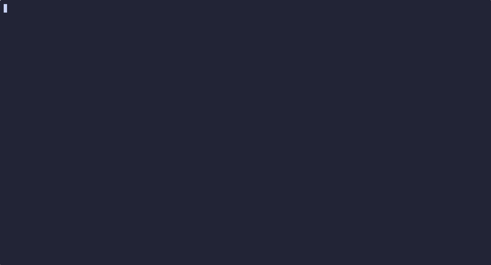

# 🎮 gotermoku

A minimal, terminal-based Gomoku game written in Go.

## Overview



A lightweight implementation of Gomoku (Five in a Row) built specifically for the terminal. It provides a distraction-free interface for local offline play, playing against an AI, and online peer-to-peer matches. It utilizes a straightforward event-driven loop and a clean xterm-256 rendering pipeline.

## Philosophy

- **Minimalism:** No heavy graphical engines or bloated web wrappers. Uses a single, lightweight TUI dependency [ttasc/ttbox](https://github.com/ttasc/ttbox).
- **Explicit over implicit:** The game runs on a single source of truth (`GameState`). State mutations are localized and predictable.
- **Server as truth:** In multiplayer, the host dictates the state and board size. The client acts as a dumb terminal to prevent desynchronization.
- **Keyboard-centric:** Built for keyboard users with native Vim bindings. Mouse support exists but remains entirely optional.

## Features

- **Offline**: Local offline play (hotseat mode).
- **AI Bot**: Single-player mode against a *built-in* `Heuristic AI Bot`.
- **P2P online**: *Peer-to-peer* TCP multiplayer (Host/Client configuration).
- **Vim-key**: Standard Arrow and Vim-style (*HJKL*) movement keys.
- **Mouse control**: Two-click mouse interactions (focus, then place).

## Architecture

The system is strictly divided into distinct operational layers:

- **Entry & Config (`main.go`, `config.go`):** Parses CLI flags, validates dimensions, and wires dependencies.
- **Orchestrator (`engine.go`):** The main game loop. Polls for TUI and network events iteratively without blocking.
- **State (`state.go`):** The isolated dynamic data model. Contains board layout slices, turn data, and metrics.
- **Input (`input.go`):** Translates physical keystrokes and mouse coordinates into logical state mutations.
- **AI Engine (`bot.go`):** Asynchronous heuristic evaluation engine for offline single-player mode.
- **Networking (`network.go`):** Asynchronous TCP socket layer handling JSON message streams via dedicated goroutines.
- **Renderer (`renderer.go`):** Purely functional view layer. Reads the state struct and translates it to terminal sequences.
- **Rules Engine (`win.go`):** Localized validation to verify win conditions efficiently without scanning the whole board.

## Installation

You can download the pre-built binary file [here](https://github.com/ttasc/gotermoku/releases/latest) or build from source:

```sh
git clone https://github.com/ttasc/gotermoku.git
cd gotermoku
go build -o gotermoku
```

> Ensure you have a working Go toolchain installed

## Usage

### Run locally (Offline Mode)
```sh
# Default size (20x30)
./gotermoku

# Custom board size
./gotermoku --size 15x15
./gotermoku -s 10x10
```

### Play against AI Bot
```sh
./gotermoku --bot
./gotermoku --bot -s 15x20
```

### Host an online game
Listen on a specified port and wait for an opponent. *(Note: The Host dictates the board size for both players).*
```sh
./gotermoku --host --port 3333 -s 20x30
```

### Join an online game
Connect to a waiting host. *(The board size will automatically sync with the Host).*
```sh
./gotermoku --join 192.168.1.50 --port 3333
```

### Controls
- `h`, `j`, `k`, `l` / `Arrows`: Move cursor
- `Space` / `Enter`: Place piece
- `Left Click`: Focus cell (1st click) / Place piece (2nd click)
- `r` / `R`: Request restart (after game ends)
- `Esc` / `Ctrl+C`: Quit game

## Development

The project requires no special build tools beyond standard Go.

```sh
go build -o gotermoku .
```

To modify rendering output, adjust the constant palette blocks located at the top of `renderer.go`. Networking protocols can be expanded by extending the `NetMessage` struct in `network.go`. To adjust the AI difficulty, tweak the weight multipliers inside `bot.go`.

## License

MIT License. See `LICENSE` for details.
